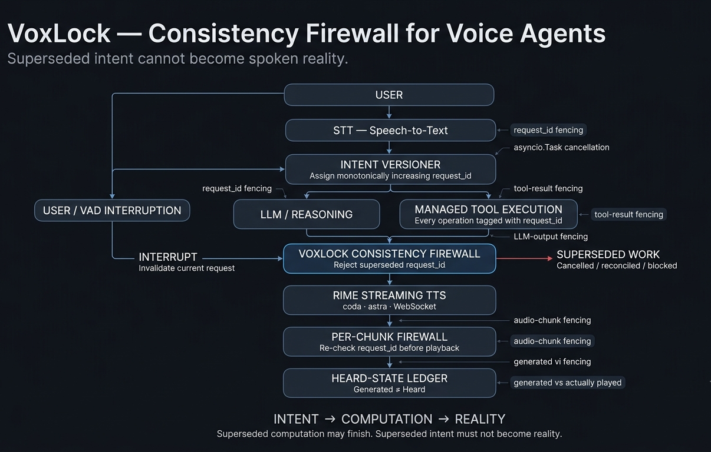

# VoxLock — Consistency Firewall for Voice Agents

> **Superseded intent cannot become spoken reality.**

GitHub: https://github.com/MayankSinghJadon17/VoxLock-consistency-firewall-.git

## Architecture



## Problem

Voice agents have a consistency problem: a user can change their mind while an agent is still computing or speaking an older request. If stale computation reaches the speaker, the user can hear something they no longer asked for.

VoxLock is a consistency firewall between **intent, computation, and spoken reality**.

Its core guarantee is:

> **Generated ≠ Heard**

Superseded computation may finish. Superseded intent must not become reality.


VoxLock assigns every user request a monotonic `request_id`. Tool work, LLM output, and streaming Rime audio are checked against the active request before they can affect what the user hears.

**USER → STT → INTENT VERSIONER → COMPUTATION → VOXLOCK FIREWALL → RIME TTS → HEARD**

An interruption invalidates the current request. The firewall then rejects superseded work at multiple boundaries.

## Hard Voice Problem: Interruption and Recovery

The demo uses a synthetic banking-transfer scenario. No real financial transaction occurs.

1. User: **"Transfer ₹50,000 to Alex."**
2. VoxLock creates request `#2`.
3. The simulated transfer tool begins.
4. User interrupts: **"Wait! Make that ₹5,000."**
5. Request `#2` is superseded.
6. Running work for `#2` is cancelled when possible.
7. Any stale result/output/audio for `#2` is fenced.
8. Request `#3` is created for the updated instruction.
9. Rime speaks only the current confirmation.

The key property is that **superseded intent cannot become spoken reality**.

## How VoxLock Enforces Consistency

- `request_id` provides monotonic intent versioning.
- `asyncio.Task` cancellation stops managed work when possible.
- Tool results are fenced before acceptance.
- LLM outputs are fenced before acceptance.
- Rime streaming audio chunks are fenced individually.
- The ledger separates generated audio from audio actually played.
- Superseded work is recorded as cancelled, blocked, or reconciled.

`voiceguard.py` contains the application-level consistency logic and has no LiveKit dependency.

LiveKit owns the transport/VAD boundary; the VoxLock bridge owns application-level interruption commit and invalidation.

## Rime Integration

Rime is the primary spoken-output provider in the demo.

- Model: `coda`
- Speaker: `astra`
- Language: English
- Endpoint: `https://users.rime.ai/v1/rime-tts`
- Audio format: PCM16
- Transport: WebSocket streaming

The Rime stream is checked per audio chunk before playback.

## Demo

The complete recorded demo is included in:

`demo/video/VoxLock-demo.mp4`

The demo shows the user problem, normal end-to-end voice interaction, deliberate interruption, supersession, cancellation/reconciliation, stale-output protection, updated Rime speech, and benchmark evidence.

## Benchmark Evidence

Latest randomized interruption benchmark:

| Metric | Result |
|---|---:|
| Trials | 50 |
| Superseded requests | 50 |
| Stale outputs spoken | 0 |
| Stale audio chunks rejected | 16 |
| Cancelled tool tasks | 15 |
| Ghost tasks reconciled | 19 |
| Audio generated | 32 |
| Audio actually played | 16 |
| Runtime | 972.8 ms |
| Result | PASS |

Run:

```powershell
pytest -q
python -m benchmark.randomized_interruption
```

The benchmark measures application-level consistency behavior. It does not claim universal physical audio-stop latency.

## Evidence

See:

- `RIME_EVIDENCE.md`
- `SUBMISSION_EVIDENCE.md`
- `results/benchmark_latest.json`

## Setup

Requirements:

- Python 3.11+
- Node.js/npm
- LiveKit credentials
- Groq API key
- Rime API key

```powershell
copy .env.example .env
pip install -r requirements.txt
```

Build the UI:

```powershell
cd ui
npm install
npm run build
cd ..
```

Run tests:

```powershell
pytest -q
```

Run Rime preflight:

```powershell
python preflight/rime_preflight.py
```

## Known Limitations

- The banking scenario is simulated and does not execute real financial transactions.
- Cancellation is best-effort; already-completed background work may still finish.
- VoxLock prevents stale work from becoming accepted/spoken output even when cancellation cannot stop computation.
- Application-level interruption latency is not physical audio transport stop latency.
- External provider/network latency can vary.

## Security

No production banking credentials, payment information, or real financial actions are used.

Secrets belong only in local environment variables and are excluded from source control.

## Submission Contents

```text
demo/
docs/
preflight/
results/
voiceguard/
tests/
ui/
```
